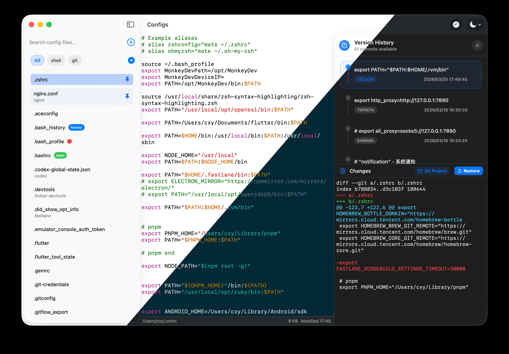

# Configs

[English README](./README_en.md)

一款 **macOS** 配置文件管理工具，快速查看、编辑和管理电脑上的各种配置文件（如 `.zshrc`、`.gitconfig` 等）。采用 SwiftUI 开发。

## 截图




## 功能

- **自动扫描**：自动发现常见的配置文件（`.zshrc`、`.bashrc`、`.gitconfig`、`.vimrc` 等）
- **即时生效**：编辑 `.zshrc` 等 shell 配置文件后，保存时自动执行 `source` 命令，改动立即生效
- **版本管理**：基于 Git 自动记录每次编辑，支持查看历史、对比差异、一键恢复
- **代码编辑器**：多种文件类型的语法高亮，支持搜索、缩放、黑暗模式
- **快捷菜单**：右键文件可以快速操作（在 Finder、Terminal、VSCode 中打开等）
- **彩色标签**：为配置文件添加短文本彩色标签，便于识别
- **分组管理**：添加自定义分组，更方便的管理配置文件
- **国际化**：内置中文和 English，默认跟随系统语言，且可在关于页面手动切换

### 快捷键
- `Cmd + F`：搜索
- `Cmd + S`：保存
- `Cmd + /`：注释切换
- `Cmd + =` / `Cmd + -`：缩放
- `Cmd + 0`：重置缩放
- `Esc`：关闭搜索

## 安装

### 编译安装
需要安装 Xcode，然后：

```bash
git clone https://github.com/iHongRen/configEditor.git
cd configEditor/Configs
# 在 Xcode 中打开 Configs.xcodeproj，选择 "My Mac" 作为目标，点击 Build (⌘B)
```

编译完成后，在 Xcode 的 Products 文件夹中找到 `Configs.app`。

### 直接安装
从 [Release 页面](https://github.com/iHongRen/configEditor/releases) 下载 `Configs.dmg`，双击打开后：

1. 将 `Configs.app` 拖到 `/Applications` 文件夹
2. 打开终端，运行以下命令：

   ```bash
   chmod +x /Applications/Configs.app/Contents/MacOS/Configs
   xattr -d com.apple.quarantine /Applications/Configs.app
   ```

3. 现在可以从应用程序文件夹或 Launchpad 打开 `Configs.app`


