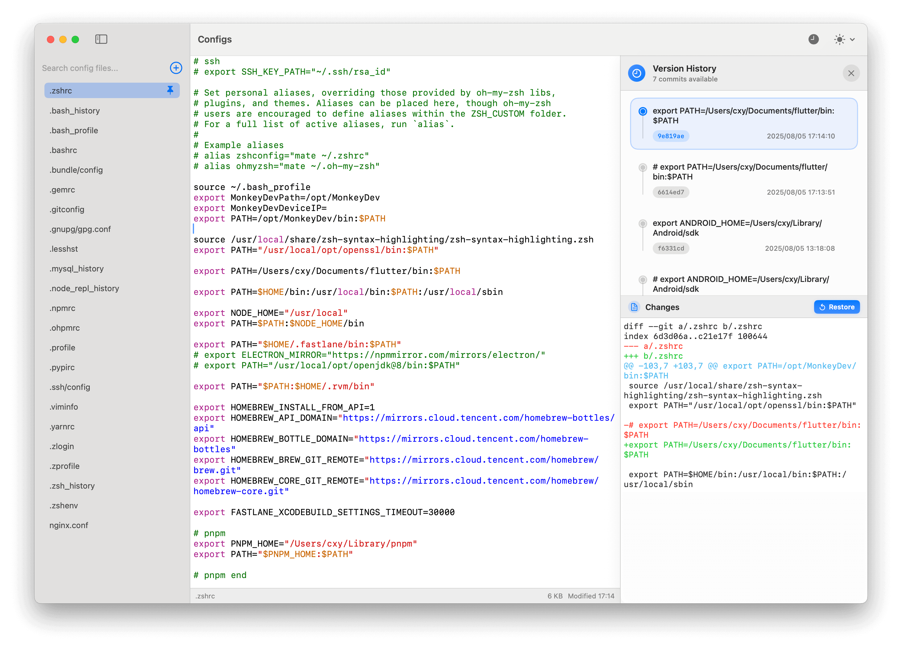

# Configs

Configs is a **macOS** **application** designed to help you easily manage and edit your configuration files.

 It automatically scans for common configuration files across various programming languages and tools, provides a convenient interface for viewing and editing them, and allows you to add your own custom configuration files.

## Screenshots



## Features

* **Automatic Discovery**: Scans your home directory for common configuration files (e.g., `.zshrc`, `.gitconfig`, `.vimrc`, `.npmrc`, etc.).

* **File Management**: Add custom configuration files, pin frequently used files for quick access, and delete custom files.

* **Code Editor**: Integrated code editor with syntax highlighting for various file types.

* **Search Functionality**: Search for specific configuration files by name or path in the sidebar, and search within the content of the currently open file.

* **Zoom Control**: Adjust the zoom level of the editor content.

* **Appearance Options**: Switch between **light** and **dark** mode.

*   **Keyboard Shortcuts**:
    *   `Cmd + F`: Show/Hide Search Bar in the editor.
    *   `Cmd + S`: Save File.
    *   `Cmd + =` / `Cmd + +`: Zoom In.
    *   `Cmd + -`: Zoom Out.
    *   `Cmd + 0`: Reset Zoom.
    *   `Esc`: Close Search Bar.
    
* **Context Menu Actions**: Right-click on a file in the sidebar for options like 

    * Pin/Unpin 
    * Copy Path,
    * Open in Finder,
    * Open in VSCode
    * Open in Cursor

## Installation

To install and run Configs, you will need Xcode installed on your macOS machine.

1.  **Clone the repository**:
    ```bash
    git clone https://github.com/iHongRen/configEditor.git
    cd configEditor/Configs
    ```

2.  **Open in Xcode**:
    Open the `Configs.xcodeproj` file in Xcode.

3.  **Build and Run**:
    Select your target (e.g., "My Mac") and click the "Run" button (▶️) in Xcode.


