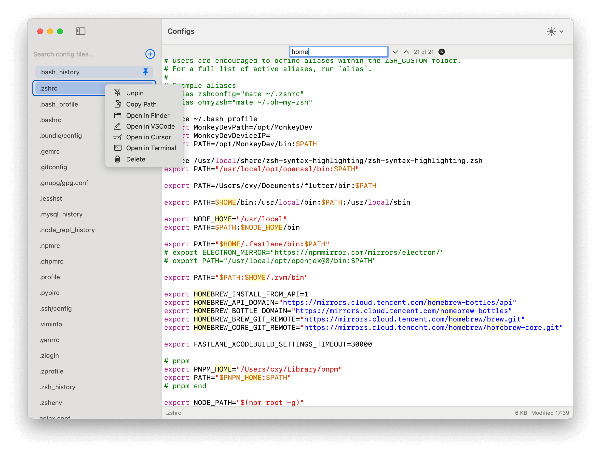
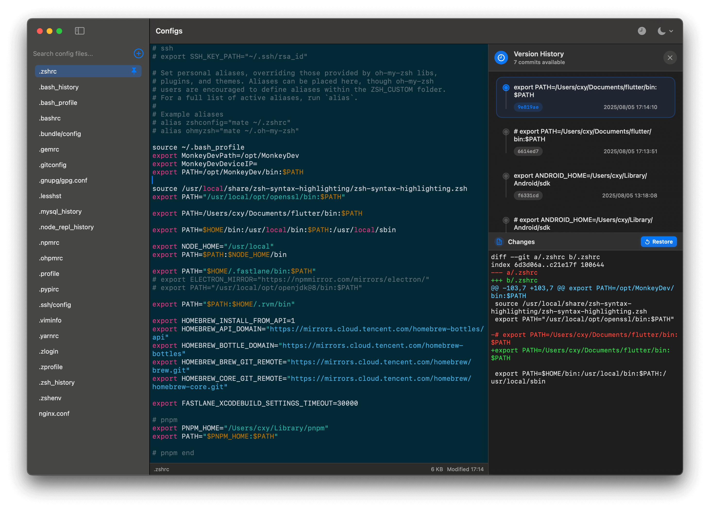
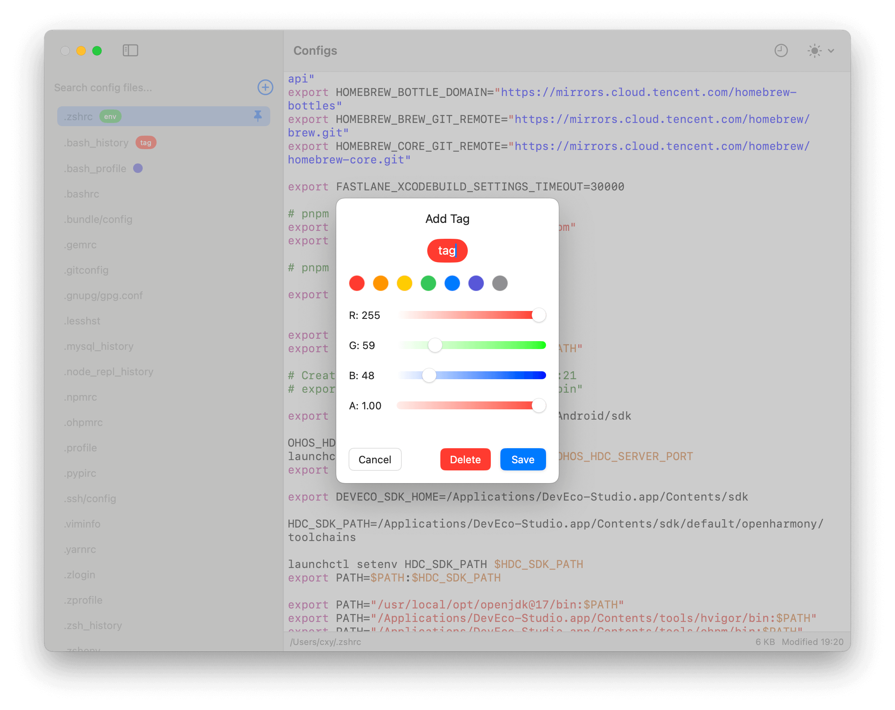

# Configs

[中文 README](./README.md)

A **macOS** config file manager that lets you quickly view, edit, and manage configuration files on your computer (such as `.zshrc`, `.gitconfig`, etc.). Built with SwiftUI.

## Screenshots







## Features

- **Auto Discovery**: Automatically finds common config files (`.zshrc`, `.bashrc`, `.gitconfig`, `.vimrc`, etc.)
- **Instant Effect**: When editing shell config files like `.zshrc`, the app automatically executes `source` on save, making changes take effect immediately
- **Version History**: Uses Git to automatically track all edits, with full history view, diff comparison, and one-click restore
- **File Management**: Add custom files, pin frequently used configs, and organize with color tags
- **Code Editor**: Syntax highlighting for multiple file types, search, zoom, and dark mode support
- **Context Menu**: Right-click files to quickly open in Finder, Terminal, VSCode, and more
- **Color Tags**: Add short colored text tags to files for easy organization

### Keyboard Shortcuts
- `Cmd + F`: Search
- `Cmd + S`: Save
- `Cmd + /`: Toggle comment
- `Cmd + =` / `Cmd + -`: Zoom
- `Cmd + 0`: Reset zoom
- `Esc`: Close search

## Installation

### Build from Source
You need to have Xcode installed:

```bash
git clone https://github.com/iHongRen/configEditor.git
cd configEditor/Configs
# Open Configs.xcodeproj in Xcode, select "My Mac" as target, and click Build (⌘B)
```

After building, find `Configs.app` in Xcode's Products folder.

### Direct Installation
Download `Configs.dmg` from the [Release page](https://github.com/iHongRen/configEditor/releases) and double-click to open:

1. Drag `Configs.app` to your `/Applications` folder
2. Open Terminal and run:

   ```bash
   chmod +x /Applications/Configs.app/Contents/MacOS/Configs
   xattr -d com.apple.quarantine /Applications/Configs.app
   ```

3. Now you can launch it from Applications folder or Launchpad
