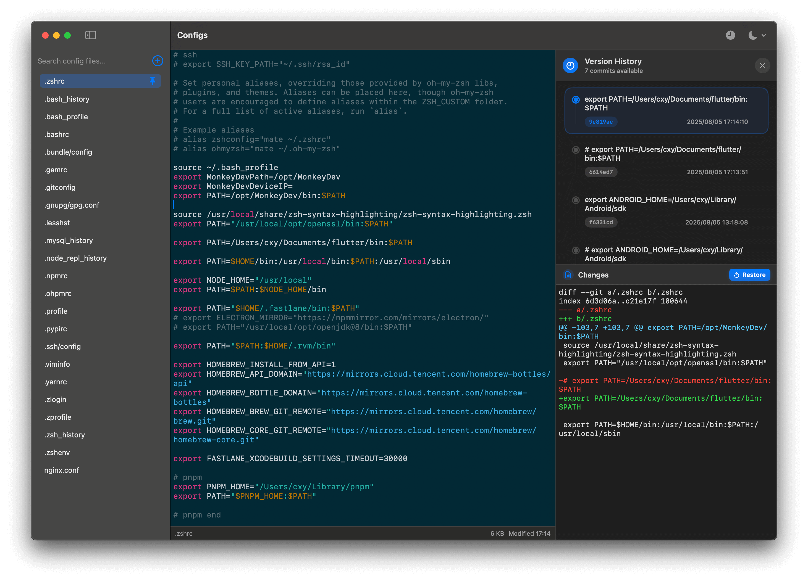

# Configs

Configs 是一款 **macOS** **应用程序**，旨在帮助您轻松管理和编辑您的配置文件,基于 SwiftUI。

它会自动扫描各种编程语言和工具的常见配置文件，提供一个方便的界面来查看和编辑它们，并允许您添加自己的自定义配置文件。

## 截图




## 功能

- **自动发现**：扫描您的主目录以查找常见的配置文件（例如，`.zshrc`、`.gitconfig`、`.vimrc`、`.npmrc` 等）。
- **自动 source**: 当编辑 .zshrc 和 .bashrc 这类文件时，保存时自动执行 `source ~/.zshrc`，使修改立即生效。
- **文件管理**：添加自定义配置文件，置顶常用文件以便快速访问，并删除自定义文件。
- **代码编辑器**：集成代码编辑器，支持多种文件类型的语法高亮。
- **搜索功能**：在侧边栏中按名称或路径搜索特定配置文件，并在当前打开的文件内容中进行搜索。
- **缩放控制**：调整编辑器内容的缩放级别。
- **外观选项**：在**浅色**和**深色**模式之间切换。
- **键盘快捷键**：
  - `Cmd + F`：在编辑器中显示/隐藏搜索栏。
  - `Cmd + S`：保存文件。
  - `Cmd + /`：注释/取消注释选中的行。
  - `Cmd + =` / `Cmd + +`：放大。
  - `Cmd + -`：缩小。
  - `Cmd + 0`：重置缩放。
  - `Esc`：关闭搜索栏。
- **上下文菜单操作**：在侧边栏中右键单击文件，可选择：
  - 置顶/取消置顶
  - 复制路径
  - 在 Finder 中打开
  - 在 VSCode 中打开
  - 在 Cursor 中打开

## 安装

要安装和运行 Configs，您需要在 macOS 机器上安装 Xcode。

1. **克隆仓库**：

   ```bash
   git clone https://github.com/iHongRen/configEditor.git
   cd configEditor/Configs
   ```

2. **在 Xcode 中打开**：
   在 Xcode 中打开 `Configs.xcodeproj` 文件。

3. **构建应用程序**：
   选择您的目标（例如，“My Mac”），然后单击 Xcode 中的“构建”按钮（⌘B）。`Configs.app` 将在 Xcode 项目导航器中的 `Products` 文件夹中生成。您可以右键单击 `Configs.app` 并选择“在 Finder 中显示”来找到它。

4. **安装并运行**：
   解压 [configs.zip](https://github.com/iHongRen/configEditor/releases) 后， 将 `Configs.app` 包拖到您的 `/Applications` 文件夹中。
   打开终端并运行以下命令，使应用程序可执行：

   ```bash
   chmod +x /Applications/Configs.app/Contents/MacOS/Configs
   ```
   现在您可以从 `/Applications` 文件夹或 Launchpad 打开应用程序。
   
   如果弹窗提示无法打开，打开 **系统偏好设置** > **隐私与安全性** > **安全性** > 允许以下来源的应用程序：**App Store与已知开发者** > **仍要打开**